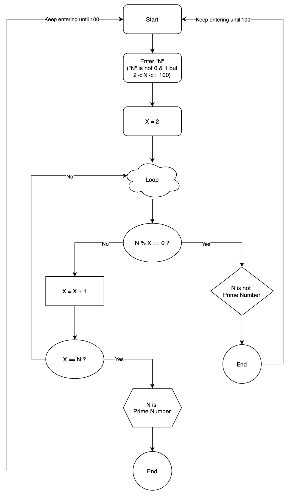

# T1A1 - Workbook

## Questions

### Q1. (300-500 words) **Research** the development of the internet from 1980 to today. You must describe at least FIVE key events in the development of the internet. You can refer to events, people of significance, or technologies and how they have changed over time.
- Domain Name System   
The Domain Name System (DNS) is a system used to manage the mapping (forward and reverse) of IP addresses to domain names used for host names and email addresses on the Internet. <br> It was developed in 1983 by Paul Mokapetris and John Postell of the Information Sciences Institute (ISI) as a hierarchical, distributed database system using the Internet.
(https://ja.wikipedia.org/wiki/Domain_Name_System). <br> Over the next 25 years, a number of groundbreaking dot-coms would be born, starting with Microsoft.com in 1993, followed by AOL.com (1995), Amazon.com (1995), eBay.com ((1995), Google.com (1997), Facebook.com (2004. The original domain was "thefacebook.com"), YouTube.com (2005), Twitter.com (2006) and others spawned in rapid succession. <br> As of 2015, .com domains are being registered at a tremendous rate, at a rate of how many registrations per second. As of the last time it was checked, there were around 117 million registered domains - an increase of 26 million from the 91 million registered five years ago.
(https://thebridge.jp/2015/03/30-years-of-com-domains)

- World Wide Web  
The World Wide Web has its origins in around 1950 and was invented in 1989 by Tim Berners-Lee of CERN, and the invention was implemented in the late 1990s, with the world's first web page published on 20 December 1990. Since then, many web pages have been published in many countries, and with the spread of viewers (web browsers) and the specification of the protocol, it has exploded to the present day. <br>The Web has enabled the greatest exchange of information between individuals in human history. Through the Web, a wide variety of information can now be freely exchanged across the globe.
(https://ja.wikipedia.org/wiki/World_Wide_Web)

- First Web-Based (webmail) Service  
The name of the service, Hotmail, was chosen because of its HTML display, spelling it as "HoTMaiL", a reference to webmail and a clear description of a mail service that had never existed before. It is also widely used on Macintosh and Unix operating systems, and is also useful for people with limited private mail, such as those in companies, because the response to other languages such as Japanese, the Hotmail was several years earlier than any other free webmail services such as Yahoo. <br> In late 1997, Microsoft acquired Hotmail, and changed the spelling to "Hotmail". Along with this acquisition, Microsoft also developed its provider business (MSN) in various countries, offering Webmail under the msn.com domain name, which also worked as Hotmail itself.
(https://ja.wikipedia.org/wiki/Hotmail)

- Google (Search Engine)  
Google was born in 1998, it changed how people search information through the internet. The company was founded by Larry Page and Sergey Brin, who were both doctoral students at Stanford University, and the two still hold a combined 16% stake in the company. The company was founded as a private company on 27 September 1998 and went public for the first time on 19 August 2004. The company's mission statement is to "Organise the world's information and make it accessible and usable by people all over the world".
(https://ja.wikipedia.org/wiki/Google)

- Major move to place TV shows online  
NBC Universal (now part of General Electric), NBC Universal (now part of Comcast), FOX Entertainment Group, a News Corporation subsidiary, Disney ABC Television Group (now Walt Disney Television), It was established on October 29, 2007 as a joint venture between Providence Equity Partners and other major mass media companies, and officially launched on March 12, 2008. It offers streaming video, TV shows, movies, short films, trailers and production footage from NBC, FOX and ABC, as well as other networks and studios. It has changed the way people watch TV from the terrestrial television to the online.
(https://ja.wikipedia.org/wiki/Hulu)


### Q2. (50 - 100 words per dot point) **Define** the features of the following technologies that are essential in terms of the development of the internet:
### **Explain** how each technology has contributed to the development of the internet.
 - packets  
In telecommunications, it is a method of grouping data sent over a digital network into packets. A packet consists of a header and a payload. The data in the header is used by the network hardware to send the packet to its destination, where the payload is extracted and used by the application software. Packet exchange is the primary basis for data communication in computer networks worldwide.  <br> When Internet access became available to all those who could pay for an ISP (Internet Service Provider) subscription, the differences between national networks became blurred. Users no longer look at network identifiers such as DNIC (Diffuse noxious inhibitory control). Some older technologies, such as circuit switching, have resurfaced under new names, such as high-speed packet switching. Researchers have created several experimental networks that complement the existing Internet.
(https://en.wikipedia.org/wiki/Packet_switching)

 - IP addresses (IPv4 and IPv6)  
IPv4   
Internet Protocol version 4 (Internet Protocol version 4), IPv4 (IPv4), is a protocol that is positioned at the network layer in the OSI reference model. It is widely used throughout the world as a basic function of TCP/IP and is used on the Internet. The problem is that the IPv4 global addresses will be exhausted and it will not be possible to allocate new IPv4 global addresses, making it impossible to add more IP devices published on the Internet. The number of IPv4 addresses managed by the Internet Assigned Numbers Authority (IANA) ran out on 3 February 2011. All the addresses managed by the RIRs (Regional Internet Registries), with the exception of AFRINIC, were also exhausted by August 2020. IPv6 is being promoted as a countermeasure to the exhaustion problem.
(https://ja.wikipedia.org/wiki/IPv4) 
<br>IPv6  
Internet Protocol Version 6 (Internet Protocol Version 6), IPv6 (IPv6), is an Internet Protocol, a protocol positioned at the network layer in the OSI reference model. IPv4, the current mainstream IPv4 protocol, allows only 232 (approx. 4.3 billion) IP addresses, but IPv6 allows 2128 (approx. 340 undecillion) IP addresses, which is one of its major features. In fact, most ISPs' general-purpose IPv4 connectivity services allocate only one address, but IPv6 connectivity services often allocate address blocks of the size of /48 to /64. <br>Some questioned the need for IPv6, saying that IPv4 address exhaustion could be addressed by existing workarounds. However, with the explosive growth of the international Internet and the rapid increase in the number of mobile phones, smartphones and other Internet-based devices, the demand for new IP addresses has exceeded the supply of IP addresses through operational improvements and new workarounds, and the demand for new IP addresses is about to reach its limit. The negative effects of workarounds are also becoming more pronounced and are hindering the spread of new forms of Internet usage.
At present, IPv6 is becoming more and more popular and the challenge is to use both IPv4 and IPv6 at the same time to move to IPv6.
(https://ja.wikipedia.org/wiki/IPv6)

 - routers and routing
<br>Router  
A communication device that relays data between two or more different networks in a computer network. It became popular when TCP/IP came into use as a communication protocol. It has a route selection function that determines through which route the data should be transmitted at the network layer.
(https://ja.wikipedia.org/wiki/%E3%83%AB%E3%83%BC%E3%82%BF%E3%83%BC, https://en.wikipedia.org/wiki/Router_(computing))
<br>Routing  
Route control is the control that determines the data delivery path on a computer network to send data to its destination. It consists of a protocol for collecting information about the topology and traffic conditions of the network and an algorithm for designing routes through the network.
(https://ja.wikipedia.org/wiki/%E3%83%AB%E3%83%BC%E3%83%86%E3%82%A3%E3%83%B3%E3%82%B0, https://en.wikipedia.org/wiki/Routing)

 - domains and DNS
<br>Domains  
In IP networks, part of the name used to identify individual computers and specify where they are connected to. In many cases, a domain name is either the name of a multi-host domain or the domain name itself is a host name and forms part of a URL. On the Internet, in order to ensure that there is absolutely no duplication of domain names around the world, the Domain Name System, centrally managed by ICANN (Internet Corporation for Assigned Names and Numbers), performs the conversion between host names and IP addresses, including domain names.
(https://en.wikipedia.org/wiki/Domain_name, https://ja.wikipedia.org/wiki/%E3%83%89%E3%83%A1%E3%82%A4%E3%83%B3%E5%90%8D)
<br>DNS  
The DNS is a system that looks up the IP address of a host (e.g. 130.94.122.197) by referring to a computer, called a DNS server, on the input of a host name (e.g. ja.wikipedia.org). To use a metaphor, the DNS is like a telephone directory that automatically looks up a telephone number from a name.
(https://ja.wikipedia.org/wiki/Domain_Name_System)

### Q3. (150 - 300 words per dot point) **Define** the features of the following technologies that are essential in terms of the development of the internet:
###  **Explain** how each technology has contributed to the development of client and server communication over the internet (50 - 150 words for each technology)
 - TCP  
The Transmission Control Protocol (TCP), also known as the Transmission Control Protocol, is one of the core protocols in the Internet Protocol Suite.
TCP is one of the two components of the Internet Protocol Suite from its inception, the other being the Internet Protocol (IP). For this reason, the entire suite is commonly referred to as "TCP/IP". TCP transfers a reliable, ordered sequence of octets from a program on the sender's computer to another program on another computer. Major Internet applications such as the World Wide Web, email, remote administration and File Transfer Protocol (FTP) use TCP. Applications that do not require high reliability data stream services may use the User Datagram Protocol (UDP). UDP provides datagram services with an emphasis on latency reduction rather than reliability. It is the transport layer of the OSI reference model. It is used as a superordinate protocol to IP, the network layer protocol. The protocol number in the IP header is 6. TCP provides one-to-one communication in the form of sessions and is often used in situations where reliability is required, such as data transfer, because of its error correction features, such as retransmission of missing packets through packet sequence checks. It is often used in situations where data transmission and other reliability is required. The IETF specifies the technical specifications in RFC 793 (STD 7). The higher level protocols include HTTP, FTP, Telnet and SSH. (https://ja.wikipedia.org/wiki/Transmission_Control_Protocol)

 - HTTP and HTTPS  
The Hypertext Transfer Protocol (HTTP) is an application layer protocol for transferring hypermedia documents, such as HTML. The protocol is designed for communication between a web browser (client) and a web server, although it can be used for other purposes as well. HTTP follows the old client-server model, where the client opens a port to send a request to the server and waits for a response from the server. HTTP is a so-called stateless protocol, meaning that the server does not hold any data between the two requests. HTTP is often used for communication over the TCP/IP layer, but it can also be used at any reliable transport layer, i.e. a protocol such as UDP where messages are not lost unintentionally. RUDP - UDP with added reliability - is also suitable as an alternative. (https://developer.mozilla.org/en-US/docs/Web/HTTP#:~:text=Hypertext%20Transfer%20Protocol%20(HTTP)%20is,be%20used%20for%20other%20purposes.)
<br> HTTPS (Hypertext Transfer Protocol Secure) is a protocol and URI scheme for making HTTP communication more secure. Strictly speaking, HTTPS is not a protocol in itself, but rather HTTPS for HTTP communication over a secure connection provided by the SSL/TLS protocol. Developed by Netscape Communications to provide authentication and encryption in HTTP communications. Initially, it was used in security-critical communications, such as the transmission of personal information and electronic payments over the World Wide Web. Since then, there has been a growing movement to replace all HTTP communications with HTTPS, due to the increased risk of man-in-the-middle attacks due to the proliferation of public wireless LANs[1], large-scale eavesdropping by PRISM, and countering Internet censorship. Unlike standard HTTP, which transmits and receives messages in plain text, HTTPS uses the SSL/TLS protocol to authenticate the server, encrypt communication content and detect tampering. HTTPS uses the well known port number 443 as a well known port number. The strength of the security protection provided by HTTPS depends on the accuracy of the SSL/TLS implementation used by the web server and browser, and the cryptographic algorithm used (see TLS). When accessing the Internet via a proxy server, it may be necessary to tunnel the proxy server during HTTPS SSL/TLS communication. In that case, use the CONNECT method. (https://ja.wikipedia.org/wiki/HTTPS)

 - web browsers (requests, rendering and developer tools)  
A web browser (internet browser) is software for connecting to a web server using a computer, smartphone or other device, with functions such as displaying web pages and following hyperlinks. It is also simply called a browser. 
Broadly speaking, web browsers have three functions.
They communicate with the server, mainly via HTTP, to retrieve content. It uses a Uniform Resource Identifier (URI) to specify the connection target.
Parsing the retrieved content according to its type (HTML/XHTML/XML, document, image, etc.).
Based on the results of the parsing, arrange characters and images appropriately, adjust the size of the characters, add colour, etc.
The HTML is then passed to the web browser's layout engine, which converts the markup into an interactive document, which can then be displayed and executed by any plug-ins that are available for Flash applications and Java applets. If an unsupported type of file is encountered, download and save it, or launch another program to open it.
HTML may contain hyperlinks to other content. The link contains a URI, and when the link is clicked on, the web browser retrieves the content indicated by that URI. (https://ja.wikipedia.org/wiki/%E3%82%A6%E3%82%A7%E3%83%96%E3%83%96%E3%83%A9%E3%82%A6%E3%82%B6)
<br> Requests   (https://developer.mozilla.org/ja/docs/Learn/Getting_started_with_the_web/How_the_Web_works)
What's happening when you type a web address into your browser is that: 
- the browser accesses the DNS server to find the actual address of the server on which the website is located.
- The browser sends an HTTP request message to the server, asking it to send a copy of the website to the client. This message, and all other data exchanged between the client and the server, is sent over the Internet using TCP/IP. 
- When the server has accepted the client's request, it sends the client a message saying "200 OK". This means "Of course you can view the website. Go ahead! This means that the web site's files are sent to the browser as a series of small chunks, called data packets. It then begins to send the website's files to the browser as a series of small chunks (chunks) called data packets.
- The browser assembles small chunks into a complete web site and displays.
Rendering(https://ja.wikipedia.org/wiki/%E3%83%AC%E3%83%B3%E3%83%80%E3%83%AA%E3%83%B3%E3%82%B0_(%E3%82%B3%E3%83%B3%E3%83%94%E3%83%A5%E3%83%BC%E3%82%BF))
Rendering refers to the use of computer programs to generate images, video, audio, etc. from abstract, higher-order information described in a data description language or data structure. The original information includes the shape of the object, the point of view from which the object is captured, the texture of the object's surface (information on texture mapping), light sources and shading." The original meaning of "render" is "to express, translate, or perform (a script, etc.)".
The software, software parts and systems that perform rendering are called rendering engines or renderers. The server farm for rendering is called a render farm.
<br> Developer tools(https://developer.mozilla.org/ja/docs/Learn/Common_questions/What_are_browser_developer_tools)  
The developer tools allow you to verify the current state of HTML, CSS and JavaScript, what assets the page accesses and how long it takes, and much more.

### Q4. (50 - 100 words on each data structure) **Identify** THREE data structures used in the Ruby programming language and **explain** the reasons for using each.
- Array  
An array is an ordered collection with an integer index of any object. Array indices start at 0, as in C and Java. The index of -1 represents the last element in the array, while -2 represents the next element in the array.(https://ruby-doc.org/core-2.5.0/Array.html) 
<br> Arrays are Ruby's built-in classes that hold a list of zero or more items and contain methods to help you easily add, access and loop these items. This is useful because if arrays didn't exist, you'd have to use a lot of variables.(https://www.rubyguides.com/2015/05/ruby-arrays/#:~:text=An%20array%20is%20a%20built,have%20to%20use%20many%20variables.)
<br> The reason for using array is that; (https://medium.com/@dljerome/lists-part-iii-lists-vs-arrays-60bdced64eed)
Arrays are randomly accessible because the index of each item in the array corresponds to a specific memory address.
Arrays only store data, so they don't waste space with pointers to other memory addresses.
Because the memory in an array is in one place, it can be accessed more efficiently than a list that requires random pointer jumps.
- Hash  
A hash is a dictionary-like collection of unique keys and their values. They are also called associative arrays and are similar to arrays, but whereas arrays use integers as indices, hashes can be of any object type. Hashes enumerate the values in the order in which the corresponding keys are inserted. (https://ruby-doc.org/core-2.7.2/Hash.html)
Compared to an array, a hash has one major advantage. The hash has a default value. This value is returned when an attempt is made to access a key that does not exist in the hash. By default, this value is nil.(http://rubylearning.com/satishtalim/ruby_hashes.html#:~:text=Compared%20with%20arrays%2C%20hashes%20have,default%20this%20value%20is%20nil.)
- Stack  
Stacks are a special kind of linked list, where search data can be stored in an efficient last-in-first-out order (LIFO). In other words, elements are retrieved in the opposite order to that in which they were stored in the stack. Like a queue, the stack does not allow elements to be inserted/removed at random locations and, like a queue, they are just a sequence of connected nodes.(https://medium.com/amiralles/stacks-are-a-special-kind-of-linked-lists-that-allow-us-to-efficiently-store-retrieve-data-in-last-9efab58fd100) <br>The big thing to note here is that new items are added to the top of the stack in a LIFO (Last-In First-Out) fashion. This means that when you take an item out of the stack, it will be the last item pushed in. Another way to visualise how this works is by thinking of a stack of plates. If you put one plate on top of another, you can't take the bottom plate without taking the top plate first. That's all you're doing with the stack, pushing things up or popping things out. There is no index. (https://www.rubyguides.com/2017/03/computer-science-in-ruby-stacks/#:~:text=What%20is%20a%20stack%20in,until%20the%20stack%20is%20empty.)

### Q5. (100 - 200 words on each way code is executed) **Describe** the features of interpreters and compilers and how they are different. 
An interpreter is a program that executes a source code or intermediate expression written in a programming language, interpreting it sequentially. It is also referred to as an "interpreter" or "interpreter". (https://ja.wikipedia.org/wiki/%E3%82%A4%E3%83%B3%E3%82%BF%E3%83%97%E3%83%AA%E3%82%BF)
A compiler is a program that converts (compiles) source code in a high-level language into machine code or code of a lower level than the original program, and is a part of the processing system (language processing system) of computer programming languages.(https://ja.wikipedia.org/wiki/%E3%82%B3%E3%83%B3%E3%83%91%E3%82%A4%E3%83%A9)
It has been said that there are two types of implementations of programming language processing systems: interpreters and compilers. There is a difference between an interpreter and a compiler, in that the interpreter executes but the compiler does not.
The most common method of the interpreter was to call the functions of the language in which the interpreter was implemented, one sentence at a time from a program statement in the language provided by the interpreter. In the case of the command line interpreter, in addition to this, the processing is delegated to another program to achieve the same function.(https://ja.wikipedia.org/wiki/%E3%82%A4%E3%83%B3%E3%82%BF%E3%83%97%E3%83%AA%E3%82%BF)

### Q6. (200 - 400 words on each language) **Identify** TWO commonly used programming languages and **explain** the benefits and drawbacks of each.
- Ruby (https://www.sejuku.net/blog/85719)  
The benefits of using Ruby are followings;
  - Versatile  
Ruby is often used to develop websites and services, but it's not the only language used for Games, Apps, APIs used in smartphone apps and Crawler. The advantage of this is that it is highly versatile, as it can be used in a variety of environments such as Mac, Windows and Linux. In addition, the way it is written is also free, and it can be said to be "highly versatile" in terms of the various ways of writing code.
  - Simple description  
Another feature and advantage of Ruby is the simplicity of its syntax and formatting. In fact, if you compare it to another development language, JavaScript, the simplicity of the language is obvious. This simplicity of grammar and formatting means that it is easier to read, requires less writing and requires less revision. In addition, less man-hours are required for development, thus reducing costs.
  - Interpreter system  
Ruby is an interpreted programming language. The interpreter method is a method in which a written program is interpreted line by line into machine language as it is executed. It is similar to translating English words into another language.
If you write a programming language as an interpreter, there is no need to convert it into words and descriptions that the machine can understand. The advantage of this is that the programming language is easy to write and the program can be tested on the spot, making it easy to find errors.
  - Being object-oriented  
Ruby is object orientation. It means a format that allows multiple closely related programs to be developed into one large group (i.e. objects). Ruby as an object format has a reputation for being an efficient development tool.
It is easy to write large programmes, easy to modify later, easy to reuse code you've already written (e.g. copying and using code written by others). This makes it very efficient. There are many active engineers who cite the efficiency of Ruby's development.  

  The drawbacks of using Ruby are followings;  
  - Slow execution
Ruby is often said to have a slow execution speed. There are two types of programming languages: interpreters and compilers. Ruby is an interpreter language and it is executed line by line, translating it into machine language. Whereas compilers method translate the programme into machine language and then run the programme. Therefore, in terms of execution speed, interpreted languages such as Ruby have the disadvantage that they are inevitably slower than compiled languages.
  - Individuals vary in their descriptions  
It is mentioned earlier that Ruby has a lot of freedom in how it is written, and that there are many different ways to write code. However, this also means that the way you write code varies from person to person. Therefore, it is often difficult to understand the code that others have written, which is a disadvantage. However, it can be resolved by unifying the way the code is written beforehand, and it has the advantage of being able to reuse already written code with ease, so it's not too much of a problem.

- JavaScript(https://mynavi-agent.jp/it/geekroid/2020/03/post-216.html)  
  The benefits of JavaScript as a programming language in practice.  
  - Easy to learn program syntax, even for beginners  
The programming syntax of JavaScript is very simple. This makes it easy to understand, even for a beginner programmer, and has the advantage of a strong community environment that makes it easy for developers to grow, since there are users all over the world.
  - Well-developed framework and libraries  
JavaScript has a wide range of frameworks and libraries. By utilizing them, you can shorten the implementation time, and therefore the development can proceed efficiently.
  - It can be used for both front-end and back-end development  
JavaScript was originally used as a language for front-end development, but with Node.js, it is now used for back-end development as well. However, Node.js is now also being used for backend development, with the advantage of being easy to manage, as JavaScript can be used to develop everything from the front end to the back end in one package.

  The disadvantages of JavaScript.  
  - Processing speed is slower than other languages  
JavaScript tends to be slower than other languages. This is due to the fact that JavaScript does not require compilation, which means that the program needs to be analysed, interpreted and converted at runtime, and this takes a long time to process.
  - Behaviour may vary depending on the browser  
As JavaScript is a language that runs in the browser, its behaviour may vary depending on the browser type and version. It takes more man-hours than normal development testing because it is necessary to test in each environment to ensure that the language works equally well in different browsers.


### Q7. (200 - 400 words for each ethical issue) **Identify** TWO ethical issues from the areas below and **discuss** the extent to which an IT professional is ethically responsible in terms of the issue.

List of topics containing ethical issues:
 - access to a user’s personal information (medical, family, financial, personal attributes such as sexuality, religion, or beliefs)
 - intellectual property, copyright, and acknowledgement.
 - criminal acts such as theft, fraud, trafficking and distribution of prohibited substances, terrorism
 - GPS tracking data and other types of metadata, MAC addresses, hardware fingerprints
 - freedom of thought, conscience, speech and the media
 - aggressive sales and marketing practices designed to mislead and deceive consumers
 - trading of shares on the stock exchange OR crypto-currencies

For each ethical issue identify a source of legal information relating to the ethical issue and discuss whether the law is helpful in assisting a developer to act in an ethical way. (Word count guide: 200 words max)

Conduct **research** into a case study of **ONE** of the ethical issues you have chosen **discuss** how an ethical IT professional should respond to the case study and how they might mitigate or prevent ethical breaches. (Word count guide: 400 - 600 words)

- Freedom of thought, conscience, speech and the media  
There is a media control rules in the Broadcasting Services Act 1992 (BSA), by Australian Communications and Media Authority. (https://www.acma.gov.au/media-control-rules)
This law basically controls the old school media such as TV, radio and newspaper. It will not be helpful in assisting a developer to act in an ethical way. The web developer is able to create, launch and publish their own media as many as they want to. When the particular web media that has millions of traffic everyday, that web media can be threatened by this BSA. This heavy traffic media could be dangerous as it could influence people to one thought and it will affect some people who want to say something different to that media’s opinion. 

- Aggressive Sales and marketing practice designed to mislead and deceive consumers  
There is a law called Therapeutic Goods Act 1989 from the Therapeutic Goods Administration (TGA), part of the Department of Health within Australian Government. This law is to protect consumers purchasing from illegal activity, misleading ads and dodgy health product ad campaigns in relation to therapeutic goods. This law is helpful for a developer to act in an ethical way because if there is no law as such, a developer is able to write a program in web service to target consumers who need the type of therapeutic goods and make them keen to buy the goods. The developers who write code with the online shopping platform will be incentivised not to breach this law as they do not want to be issued infringement notices with penalties by TGA. 

- The case study for Aggressive Sales and marketing practice designed to mislead and deceive consumers topic is “Lorna Jane fined almost $40,000 for alleged advertising breaches in relation to COVID-19 and “anti-virus activewear” Refer to (https://www.tga.gov.au/media-release/lorna-jane-fined-almost-40000-alleged-advertising-breaches-relation-covid-19-and-anti-virus-activewear)
As an IT professional for this case, they should consult thoroughly with lawyers and chief executives before launching the advertisement via online. For this case, as a therapeutic goods supplier their products need to stand out in the market to be able to win the market share. To be able to stand out, the business needs to be advertised actively but not aggressively. The IT professional makes full use of web development and target market knowledge to sell the product is completely fair and ethical way to do the business but if what the ads say is misleading and deceptive then it is unethical like this case. What IT professionals should do to mitigate ethical breaches is to understand the Therapeutic Goods Act 1989 in depth, see if products the business wants to sell does what it states in ads and does not breach the law. IT professionals should also discuss with marketer who write and use the advertising slogan when writing the web services description if this way of marketing is in an ethical way to target consumers who are sensitive to COVID-19 and taking an advantage by stating the products prevent from disease when it is worn. 

## Q8. (100 words) Explain control flow, using an example from the Ruby programming language
(https://en.wikibooks.org/wiki/Ruby_Programming/Syntax/Control_Structures)
Ruby allows the execution of code to be controlled using a conditional branch. The conditional branch takes the result of a test expression and executes a block of code depending on whether the test expression is true or false. If the test expression evaluates to the constant false or nil, the test is false, otherwise it is true. Note that zero is considered false whereas in many other programming languages zero is considered true. In many common programming languages, a conditional branch is a statement. They can influence which code is executed, but they are not values in themselves. In Ruby, however, a conditional branch is an expression. It evaluates a value just like any other expression. For example, an if expression not only determines whether or not a subordinate block of code is executed, but also results in a value itself. If the block is not executed, the if expression returns nil. For example, the following if expression evaluates to 2.
```
if true
  2
end
```
**if experession**  
Examples:  
```
a = 4
  if a == 3
    a = 6
  end
  print a # Prints 5 since the if-block isn't executed
```

## Q9. (100 words) Explain type coercion
Type coercion is the automatic or implicit conversion of a value from one data type to another (e.g. from a string to a number). Type conversions and type coercion are very similar and both convert values from one type to another, with one important difference: type coercion is implicit, whereas type coercion is implicit. Type coercion is implicit, whereas type conversion can be either implicit or explicit.
(https://developer.mozilla.org/ja/docs/Glossary/Type_coercion)  
In certain situations it is possible to implicitly enforce type conversions. These conversions are generally just a weakening of the type and are mainly focused around pointers and lifetime. They are mostly there to make Rust "just work" in more cases, and for the most part do little harm.
(https://doc.rust-jp.rs/rust-nomicon-ja/coercions.html)

## Q10. (100 words) Explain data types, using examples
In programming, a data type or simply a type is a label that indicates and categorises the type of value. It is also referred to as a data type.

For example, 0, 1 and -42 can be labelled as an "integer" type and "foo" and "Hello" as a "string" type. Types are also given to various other values such as data objects, functions, variables, constants, literals, operators and expressions that are bound to them. By checking data types with the type system, it is possible to check bugs in the code. It also makes it possible to optimise the compiler by types.
(https://en.wikipedia.org/wiki/Data_type) (https://ja.wikipedia.org/wiki/%E3%83%87%E3%83%BC%E3%82%BF%E5%9E%8B#:~:text=%E3%83%97%E3%83%AD%E3%82%B0%E3%83%A9%E3%83%9F%E3%83%B3%E3%82%B0%E3%81%AB%E3%81%8A%E3%81%91%E3%82%8B%E3%83%87%E3%83%BC%E3%82%BF%E5%9E%8B%EF%BC%88%E3%83%87%E3%83%BC%E3%82%BF,%E5%9E%8B%E3%81%AB%E3%83%A9%E3%83%99%E3%83%AB%E3%81%A5%E3%81%91%E3%81%A7%E3%81%8D%E3%82%8B%E3%80%82)


## Q11. (N/A words) Here’s the problem: “There is a restaurant serving a variety of food. The customers want to be able to buy food of their choice. All the staff just quit, how can you build an app to replace them?”
 - Identify the classes you would use to solve the problem
 - Write a short explanation of why you would use the classes you have identified

To solve the problem, “Food” clase will be used. The reason using the “Food” class for this app is you can have the objects for example, hamburger, chips, pizza, etc. For the methods, we can also have for example, taking orders, receiving payments from customers, wrapping up the foods, delivering to the customer, etc. 

## Q12. (100 words) Identify and explain the error in the code snippet below that is preventing correct execution of the program
There is an error after the “gets” when asking the user to enter the number to calculate the Fahrenheit. There is a formula to calculate the Fahrenheit therefore it needs to add “to_f” to convert it to the numbers with decimal points. The attached is the correct code below.

```
celsius = gets.to_f
fahrenheit = (celsius * 9 / 5) + 32
print "The result is: "
print fahrenheit
puts "."
```

## Q13. (N/A words) The code snippet below looks for the first two elements that are out of order and swaps them; however, it is not producing the correct results. Rewrite the code so that it works correctly.
```
arr = [5, 22, 29, 39, 19, 51, 78, 96, 84]
i = 0
while (i < arr.size -1 and arr[i] < arr[i +1])
 i = i + 1 end
puts i
 arr[i] = arr[i + 1]
 arr[i + 1] = arr[i]
```
## Q14. (N/A words) Demonstrate your algorithmic thinking through completing the following two tasks, in order:
 1. Create a flowchart to outline the steps for listing all prime numbers between 1 and 100 (inclusive). Your flowchart should make use of standard conventions for flowcharts to indicate processes, tasks, actions, or operations  
 
 2. Write pseudocode for the process outlined in your flowchart  
Prime number is a number which is exactly divisible by 1 and itself.  
Step 1. Start  
Step 2. Enter “N”. “N” is not 0 neither 1 but “N” is greater than 2 and smaller than or equal to 100. Enter numbers from 3 to 100 to find out all prime numbers between 1 and 100.  
Step 3. “X” is equal to 2  
Step 4. Loop  
Step 5. Is “N” divided by “X” equal to 0?  
Step 6. If Yes to Step 5, then “N” is not Prime Number. End.  
Step 7. If No to Step 5, then add 1 to “X”  
Step 8. See if “X” is equal to “N”.  
Step 9. If Yes to Step 8 then “N” is Prime Number. Go back to Step 2. and keep entering the numbers until 100.  
Step 10. If No to Step 8 then go back to Step 4. Loop.

 ## Q15. (N/A words) Write pseudocode OR Ruby code for the following problem:
*You have access to two variables: raining (boolean) and temperature (integer). If it’s raining and the temperature is less than 15 degrees, print to the screen “It’s wet and cold”, if it is less than 15 but not raining print “It’s not raining but cold”. If it’s greater than or equal to 15 but not raining print “It’s warm but not raining”, and otherwise tell them “It’s warm and raining”.*
```
puts "What's the temperature today?"
temperature = gets.chomp.to_i
puts "Is it raining?"
raining = gets.chomp
 
# it’s raining and the temperature is less than 15 degrees
if raining == "yes" && temperature < 15
 puts "It's wet and cold"
# if it is less than 15 but not raining
elsif raining != "yes" && temperature < 15
 puts "It's not raining but cold"
# it’s greater than or equal to 15 but not raining
elsif raining != "yes" && temperature >= 15
 puts "It's warm but not raining"
else
 puts "It's warm and raining"
end
```

## Q16. (N/A words) An allergy test produces a single numeric score which contains the information about all the allergies the person has (that they were tested for). The list of items (and their value) that were tested are:
 - eggs (1)
 - peanuts (2)
 - shellfish (4)
 - strawberries (8)
 - tomatoes (16)
 - chocolate (32)
 - pollen (64)
 - cats (128)

So if Tom is allergic to peanuts and chocolate, he gets a score of 34.

Write a program that, given a person’s score can tell them:
<dl>
 <dd> a) whether or not they’re allergic to a given item
 </dd>
 <dd>
 b) the full list of allergies.
 </dd>
 <dl>

```
def allergy_score(score)
 new_allergy_list = []
 allergies = {128 => 'cats', 64 => 'pollen', 32 => 'chocolate', 16 => 'tomatoes', 8 => 'strawberries', 4 => 'shellfish', 2 => 'peanuts', 1 => 'eggs'}
  allergies.each do |number, allergy|
   if score - number >= 0
     new_allergy_list << allergy
     score = score - number
   end
 end 
   new_allergy_list
end
# So if Tom is allergic to peanuts and chocolate, he gets a score of 34.
# Write a program that, given a person’s score can tell them:
#  a) whether or not they’re allergic to a given item
#  b) the full list of allergies.
puts "Enter allergy type you would like to check here:"
allergy_type = gets.chomp
puts "Enter your allergy score here:"
allergy_score = gets.chomp
puts "You are allergic to the following items:"
puts allergy_score (128)
```